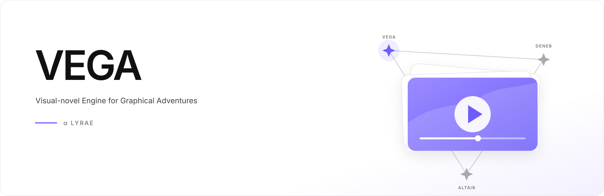

# Vega

[English](README.md) · [简体中文](README.zh-CN.md) · [繁體中文](README.zh-TW.md) · [日本語](README.ja.md) · [한국어](README.ko.md)



**VEGA** — **V**isual-novel **E**ngine for **G**raphical **A**dventures

Vega 是面向 Web 與原生應用的可擴充視覺小說引擎。它把劇情專案變成可互動作品，
同時允許專案自由選擇渲染器、角色系統、主題、資源來源與介面。


## Vega 能做什麼

- 播放對白、選項、場景、動畫、音訊、影片與轉場。
- 提供存檔、回看、設定與分支劇情。
- 嵌入網頁，並支援 Vue、React 與 Web Component。
- 透過外掛加入進階渲染、動態角色及自訂介面。

Vega 不附帶專有角色 SDK 或遊戲素材。專案只需提供自己需要且有權使用的外掛與執行環境。

## 開始使用

[First Light](https://github.com/haneoka-gakuen/vega-example-first-light)
是可編輯的完整範例專案。

```sh
pnpm install
pnpm check
```

使用 [Altair](https://github.com/haneoka-gakuen/altair) 創作與本地化專案，
使用 [Deneb](https://github.com/haneoka-gakuen/deneb) 建置發布版本。

Vega 以 MPL-2.0 發布。
